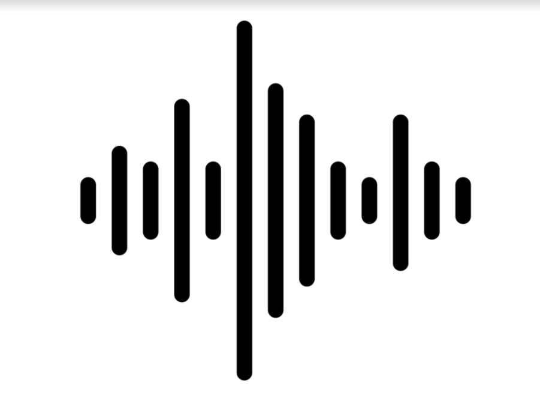

# Vocal App

This is a Vocal app which contains features like **Metronome, Piano, Vocal Analyzer, and lessons** for musician. New user can login with their email and use the feature available in the app.
## Metronome
Metronome features lets user play, pause, increase and decrease tempo for their desire need.

## Piano
The app lets user play paino horizontally and tune thier instrument, voice to the desired note.

## Vocal Analyzer
One of the most **important feature** of the app. Musician can record their voice and find out if they are in-tune with the note they want to in real-time.

## Lessons
User can find music lessons on the app and refer them for better understanding.

## Tech Stack
Vocal App is build using Flutter framework and connected to database using Firebase.
